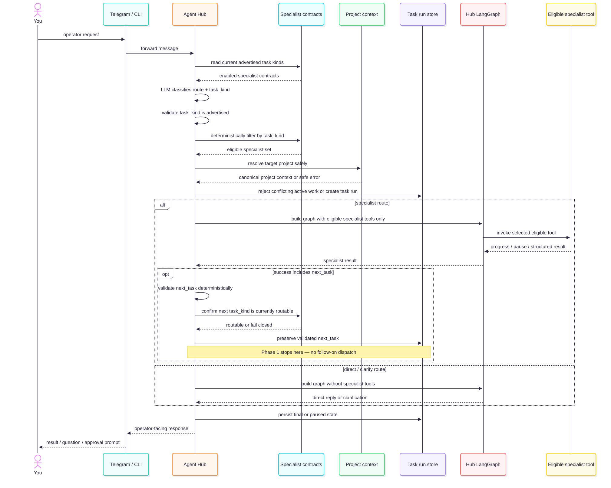

# Hub routing

Current operator-to-specialist routing overview.

Source: [`01-HUB-ROUTING.mmd`](01-HUB-ROUTING.mmd) · Rendered: [`01-HUB-ROUTING.svg`](01-HUB-ROUTING.svg)

On a successful specialist result, `next_task` is optional. If present, Hub validates the exact
`task_kind`/`task`/`references` contract and checks `task_kind` against the current eligible
registry. Phase 1 records a valid value and stops with no follow-on specialist dispatch. Invalid
contracts fail closed, and Hub never infers `next_task` from natural-language output. Runtime code
and tests remain authoritative.

Use the focused diagrams for clarification, Factory approval and explicit learning.
