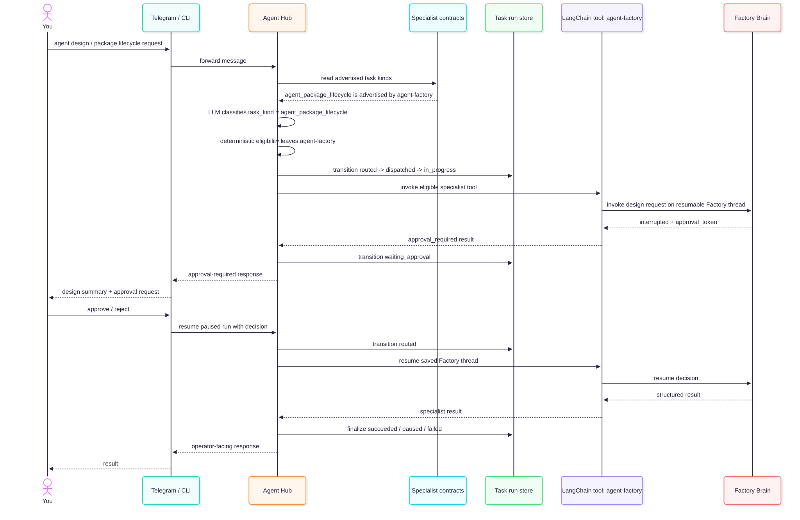

# Factory approval path

Design path for routing agent-creation work to Factory Brain and resuming after approval. This path is available only when the Agent Factory runtime and Hub bridge pass health checks.

Source: [`03-HUB-FACTORY-APPROVAL.mmd`](03-HUB-FACTORY-APPROVAL.mmd) · Rendered: [`03-HUB-FACTORY-APPROVAL.svg`](03-HUB-FACTORY-APPROVAL.svg)
