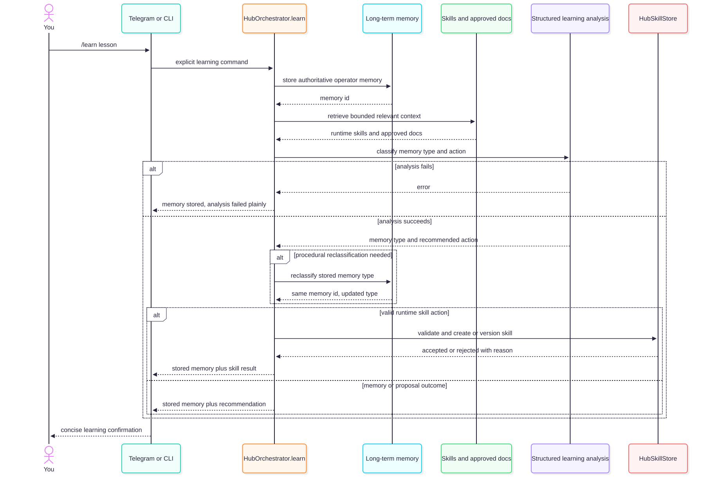

# Explicit learning

`/learn` stores the operator lesson immediately, retrieves bounded relevant
context, runs one structured analysis, and only then applies reclassification
or a governed runtime-skill action. Documentation, backlog, code and
new-specialist outcomes remain proposals.

Source: [`04-HUB-EXPLICIT-LEARNING.mmd`](04-HUB-EXPLICIT-LEARNING.mmd) · Rendered: [`04-HUB-EXPLICIT-LEARNING.svg`](04-HUB-EXPLICIT-LEARNING.svg)

Automatic `/learn-mode` extraction is a separate, opt-in background workflow.
