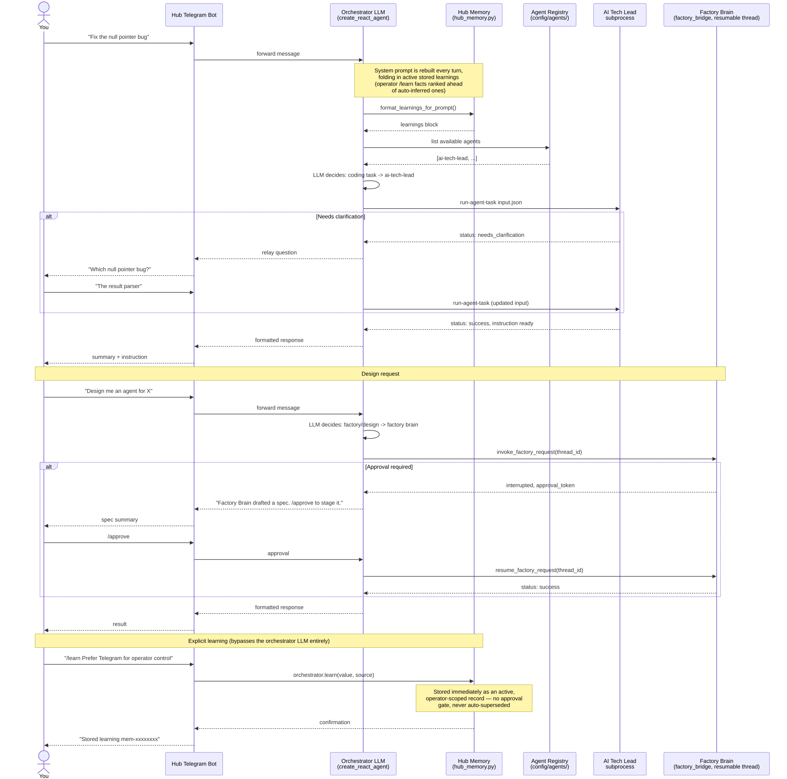

# Hub routing

Current operator-to-specialist routing overview.

Source: [`05-HUB-ROUTING.mmd`](05-HUB-ROUTING.mmd) · Rendered: [`05-HUB-ROUTING.svg`](05-HUB-ROUTING.svg)

Use the focused diagrams for clarification, Factory approval and explicit learning. Runtime code and tests remain authoritative.
