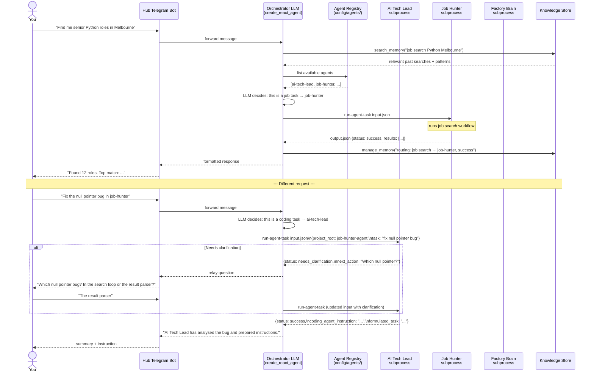

# Hub Routing — Interaction Diagram

This is the interaction diagram for how a request reaches the right agent.
The orchestrator receives every request and decides which agent handles it.
You never route manually unless you want to.



## How the LLM decides which agent to call

Each enabled agent in `config/agents/` becomes a tool in the orchestrator's tool list:

```
Tool: ai-tech-lead
Description: "AI Tech Lead: Handles coding task clarification, risk review,
              planning, and instruction generation for coding backends."

Tool: job-hunter  
Description: "Job Hunter: Finds job listings matching skills and location."
```

The orchestrator LLM reads your message and picks the right tool. If no agent fits, it answers directly or says what's missing.
