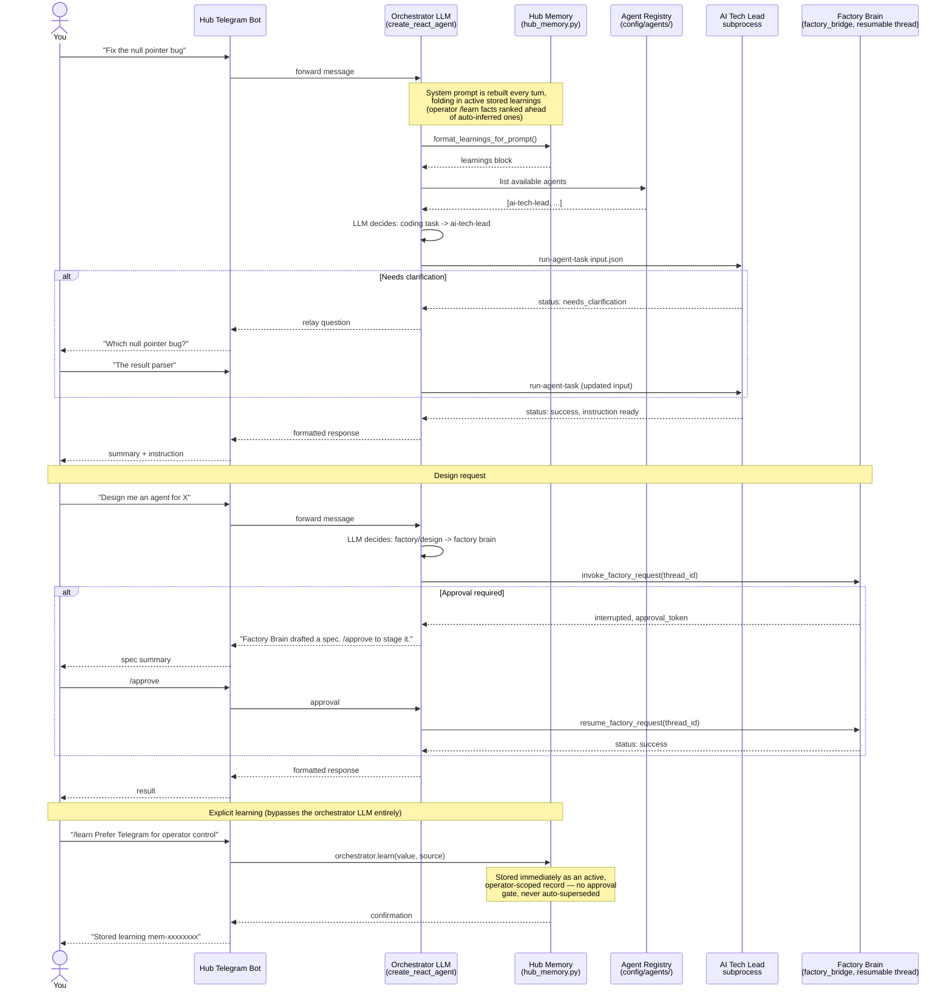

# Hub Routing — Interaction Diagram

This is the interaction diagram for how a request reaches the right agent.
The orchestrator receives every request and decides which agent handles it.
You never route manually unless you want to.



## How the LLM decides which agent to call

Each enabled agent in `config/agents/` (plus Factory Brain, wired in directly) becomes a tool in the orchestrator's tool list:

```
Tool: ai-tech-lead
Description: "AI Tech Lead: Handles coding task clarification, risk review,
              planning, and instruction generation for coding backends."

Tool: factory-brain
Description: "Specialist agent for creating, configuring, validating,
              and staging agents."
```

The orchestrator LLM reads your message and picks the right tool. If no agent fits, it answers directly or says what's missing.

## Memory: automatic vs. explicit

`/learn`, `/memory`, `/forget`, and `/learn-mode` are intercepted as commands before the
message ever reaches the orchestrator LLM — `HubOrchestrator.learn()` writes directly
to storage with no approval gate. Separately, on every LLM turn `_build_system_prompt`
re-reads the store and folds active learnings into the system prompt, with
operator-established (`/learn`) records always ranked ahead of auto-inferred ones so a
newer background guess can never crowd out an older explicit instruction. See
`src/agent_hub/hub_memory.py` for the full operator/auto scope model.
