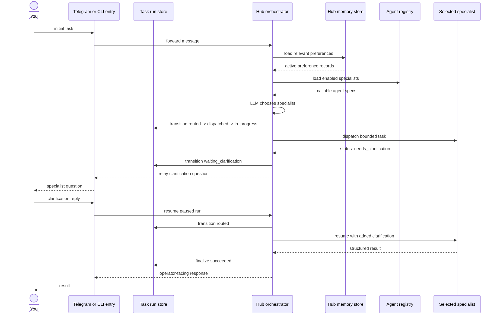

# Hub Routing — Clarification Resume Path

This path shows what happens when the selected specialist cannot safely proceed
without a follow-up answer from the operator.

Source: [05B-HUB-CLARIFICATION.mmd](05B-HUB-CLARIFICATION.mmd) | Rendered asset: [05B-HUB-CLARIFICATION.svg](05B-HUB-CLARIFICATION.svg)

The key point is that Hub keeps ownership of the paused run and only resumes the
same selected specialist after the human supplies the missing detail.

Implementation reference: the human-facing “check saved preferences” step is the
prompt rebuild in `src/agent_hub/orchestrator.py`, not a separate learning pass.
