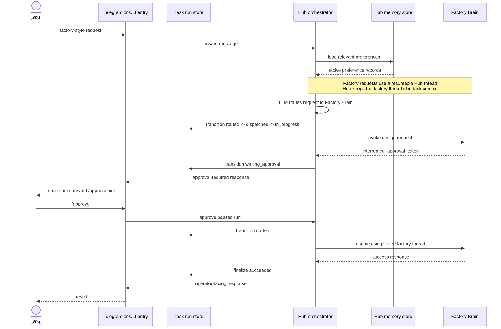

# Hub Routing — Factory Approval Path

This path shows the design-and-stage flow that routes to Factory Brain and pauses
for explicit operator approval before staging continues.

Source: [05C-HUB-FACTORY-APPROVAL.mmd](05C-HUB-FACTORY-APPROVAL.mmd) | Rendered asset: [05C-HUB-FACTORY-APPROVAL.svg](05C-HUB-FACTORY-APPROVAL.svg)

Unlike normal specialist dispatch, this path is centered on a resumable Factory
thread and an explicit approval gate.

Implementation reference: the resumable thread lives behind the factory bridge in
`src/agent_hub/factory_bridge.py`.
