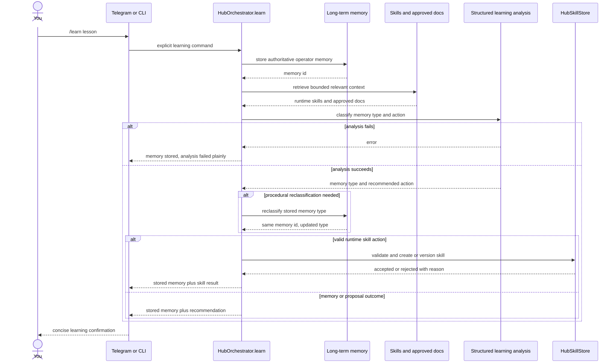

# Hub Routing — Explicit Learning Command

This path shows the explicit `/learn` command. It bypasses the orchestrator LLM
and writes directly to Hub memory.

Source: [05D-HUB-EXPLICIT-LEARNING.mmd](05D-HUB-EXPLICIT-LEARNING.mmd) | Rendered asset: [05D-HUB-EXPLICIT-LEARNING.svg](05D-HUB-EXPLICIT-LEARNING.svg)

Automatic background learning is separate. `/learn-mode` is off by default and,
when enabled, runs later after a completed task and a quiet period.

Implementation reference: this command ends up in `HubOrchestrator.learn()` and
then `HubMemoryManager.learn()`.
