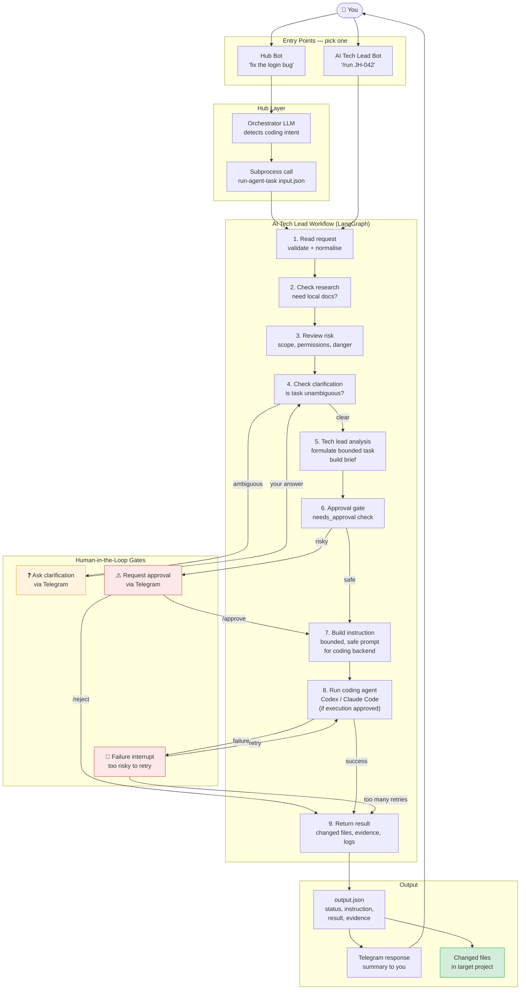

# Coding Task — End to End

A full coding task from your message to changed files, through every layer.

## What each step does

| Step | Purpose | Can pause? |
|---|---|---|
| Read request | Validate task is not empty | No |
| Check research | Does this task need LangChain docs? | Yes — asks if online fetch needed |
| Review risk | Scope creep? Dangerous operations? | No — flags but continues |
| Check clarification | Is the task specific enough to act on? | Yes — asks you |
| Tech lead analysis | Formulates the bounded task + brief | No |
| Approval gate | Should a human approve before execution? | Yes — /approve or /reject |
| Build instruction | Creates the prompt for the coding backend | No |
| Run coding agent | Calls Codex/Claude Code with the instruction | Yes — on failure |
