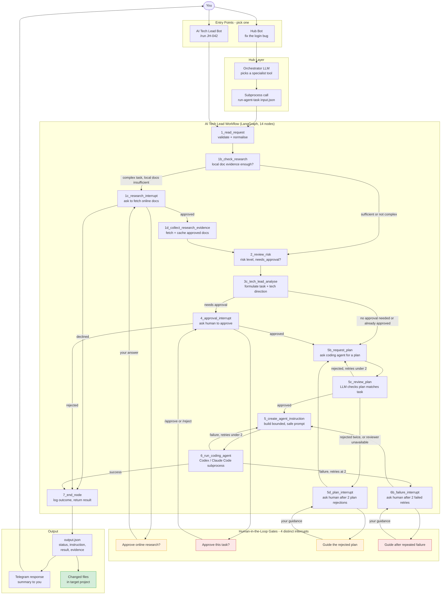

# Coding Task — End to End

A full coding task from your message to changed files, through every layer.

Source of truth: `ai_tech_lead/coding_workflow_graph.py` (`NodeName` enum + `build_graph()`). This
replaces an earlier 9-step version of this diagram that had drifted from the real graph — it was
missing the entire plan-review loop (`request_plan` → `review_plan`, with up to 2 auto-retries
before asking you for guidance) and showed a generic "clarification" gate that doesn't actually
exist in the code.

## What each node does

| Node | Purpose | Can pause? |
|---|---|---|
| `1_read_request` | Validate the request isn't empty | No |
| `1b_check_research` | Does this task need local doc evidence? | No — decides routing only |
| `1c_research_interrupt` | Ask to fetch online docs when local evidence is insufficient | Yes — asks you |
| `1d_collect_research_evidence` | Fetch + cache the approved online sources | No |
| `2_review_risk` | Decide risk level and whether approval is required | No — flags but continues |
| `3c_tech_lead_analyse` | Formulate the bounded task + tech direction | No |
| `4_approval_interrupt` | Should a human approve before planning/execution? | Yes — `/approve` or `/reject` |
| `5b_request_plan` | Ask the coding agent for a high-level implementation plan | No |
| `5c_review_plan` | LLM checks the plan actually matches the task | No — routes to retry or human |
| `5d_plan_interrupt` | Ask you for guidance after 2 plan rejections, or if the reviewer is unavailable | Yes — asks you |
| `5_create_agent_instruction` | Build the bounded, safe prompt for the coding backend | No |
| `6_run_coding_agent` | Run Codex/Claude Code with the instruction | Yes — on repeated failure |
| `6b_failure_interrupt` | Ask you for guidance after 2 failed coding-agent retries | Yes — asks you |
| `7_end_node` | Log the final outcome and return the result | No |

## Known gap

When driven through the hub's subprocess path (rather than the AI Tech Lead bot directly),
`5d_plan_interrupt` and `6b_failure_interrupt` don't map to clean `needs_clarification` /
`approval_required` statuses in `agent_task_runner.py` — they currently fall through to a generic
`blocked` status, unlike the research and approval interrupts. Worth tightening if the hub ever
needs to resume a paused plan/failure interrupt the same way it resumes approvals today.
