# LangGraph node flow

Educational view of the current Hub routing and LangGraph execution path, including the boundary between LLM classification and deterministic task-contract filtering. This is an explanatory view; code and tests remain authoritative.

Source: [`06-HUB-LANGGRAPH-NODE-FLOW.mmd`](06-HUB-LANGGRAPH-NODE-FLOW.mmd) · Rendered: [`06-HUB-LANGGRAPH-NODE-FLOW.svg`](06-HUB-LANGGRAPH-NODE-FLOW.svg)
