# Compiled Hub LangGraph topology

Low-level graph generated from the actual compiled LangGraph. It proves the runtime node topology; it is **not** the full business-process view.

Source: [`07-HUB-COMPILED-LANGGRAPH.mmd`](07-HUB-COMPILED-LANGGRAPH.mmd) · Rendered: [`07-HUB-COMPILED-LANGGRAPH.svg`](07-HUB-COMPILED-LANGGRAPH.svg)

For learning how Hub routes and executes work, use [`06-HUB-LANGGRAPH-NODE-FLOW.md`](06-HUB-LANGGRAPH-NODE-FLOW.md).
