# Hub Orchestrator — LangGraph Tool Wiring

This shows the tools the Hub's LangGraph react agent can call directly.
It is a callable-tool map, not a LangGraph node map.

- callable shared-docs tool: `search_shared_docs`
- callable specialist tools: each enabled agent ID, currently `ai-tech-lead`

If you want the actual node loop (`agent -> tools -> agent`), use
[07B-HUB-LANGGRAPH-NODE-FLOW.md](07B-HUB-LANGGRAPH-NODE-FLOW.md) instead.

Source: [07-HUB-LANGGRAPH-TOOLS.mmd](07-HUB-LANGGRAPH-TOOLS.mmd) | Rendered asset: [07-HUB-LANGGRAPH-TOOLS.svg](07-HUB-LANGGRAPH-TOOLS.svg)

Generated from the current agent-factory registry (`config/agents/*/agent.json`)
and `HubOrchestrator`'s LangGraph tool wiring — rerun
`scripts/render_hub_mermaid_diagrams.sh` and update this diagram whenever a
specialist is added or removed. `/learn`, `/memory`, and `/forget` are operator
commands handled outside the LangGraph tool list, not tools the LLM calls.
