# Hub Orchestrator — LangGraph Node Flow

This diagram shows the Hub's internal LangGraph loop with the real node names
called out directly. The current Hub graph has two LangGraph nodes: `agent`
and `tools`.

- `agent`: the LLM reasoning node
- `tools`: the tool-execution node



Source: [07B-HUB-LANGGRAPH-NODE-FLOW.mmd](07B-HUB-LANGGRAPH-NODE-FLOW.mmd) | Rendered asset: [07B-HUB-LANGGRAPH-NODE-FLOW.svg](07B-HUB-LANGGRAPH-NODE-FLOW.svg)

Render this flowchart with:

```bash
bash scripts/render_hub_flowcharts.sh
```

What it covers:

- the operator message entering Hub
- the `agent -> tools -> agent` loop
- the current Hub toolset available to that loop
- the direct-reply exit once the `agent` node has enough information
