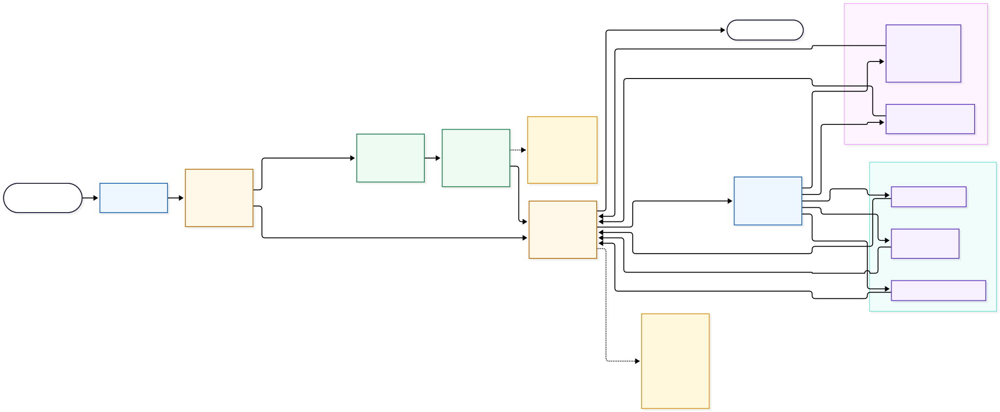

# LangGraph node flow

Educational view of the current Hub routing and LangGraph execution path, including the boundary between LLM classification and deterministic task-contract filtering. This is an explanatory view; code and tests remain authoritative.

Source: [`07B-HUB-LANGGRAPH-NODE-FLOW.mmd`](07B-HUB-LANGGRAPH-NODE-FLOW.mmd) · Rendered: [`07B-HUB-LANGGRAPH-NODE-FLOW.svg`](07B-HUB-LANGGRAPH-NODE-FLOW.svg)
