# Cross-specialist execution plan — learning view

This diagram explains the frozen Factory -> Hub -> human -> implementation plan. It is a **planned workflow**, not a claim that all of these steps are LangGraph nodes today.

Source: [`09-CROSS-SPECIALIST-EXECUTION-PLAN.mmd`](09-CROSS-SPECIALIST-EXECUTION-PLAN.mmd) · Rendered: [`09-CROSS-SPECIALIST-EXECUTION-PLAN.svg`](09-CROSS-SPECIALIST-EXECUTION-PLAN.svg)

Learning boundary:

- **LLM reasoning** interprets ambiguous natural language.
- **Contract validation, eligibility filtering, lifecycle state, approvals and stop conditions** stay deterministic where rules are known.
- Phase 1 ends after Hub validates `next_task`; Phase 2 adds the cross-specialist human approval and dispatch.
